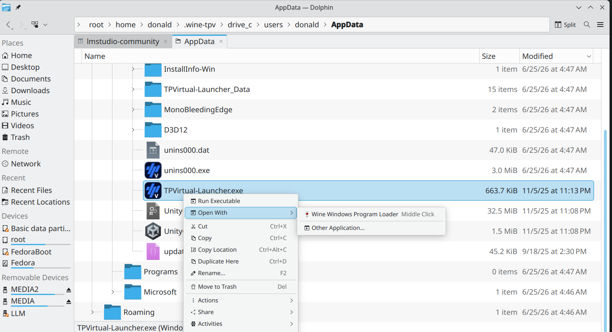
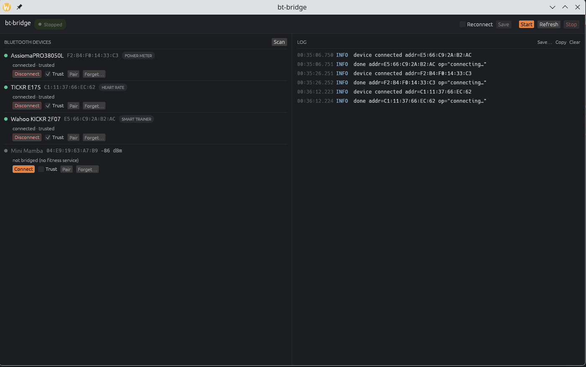
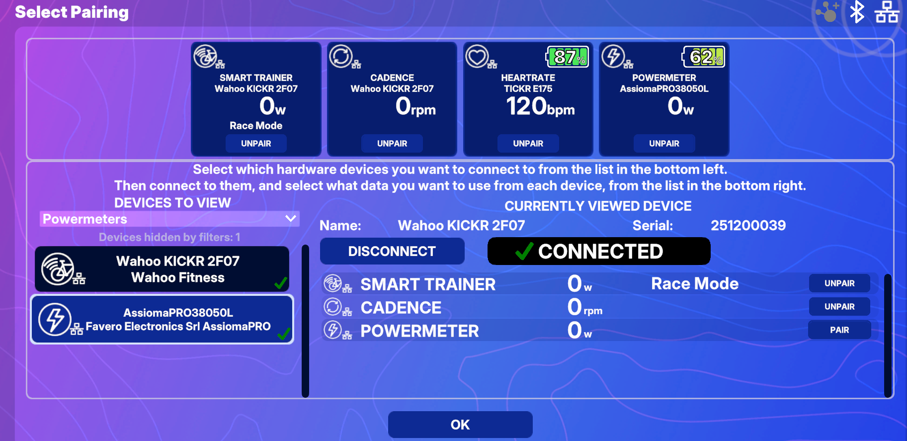

- [Introduction](#introduction)
  - [Requirements](#requirements)
- [Associated Software](#associated-software)
  - [Wine](#wine)
    - [Install with Flatpak](#install-with-flatpak)
  - [Steam](#steam)
    - [Installing Non-Steam Applications](#installing-non-steam-applications)
- [Cycling Applications](#cycling-applications)
  - [TrainingPeaks Virtual (TPV)](#trainingpeaks-virtual-tpv)
  - [Zwift](#zwift)
    - [Notes](#notes)
    - [References and Resources](#references-and-resources)
  - [MyWhoosh](#mywhoosh)
- [bt-bridge](#bt-bridge)
  - [Installing bt-bridge](#installing-bt-bridge)
  - [Desktop Application](#desktop-application)
    - [The Bluetooth panel](#the-bluetooth-panel)
    - [Troubleshooting](#troubleshooting)
  - [Command Line Use](#command-line-use)

# Introduction

bt-bridge is a Linux application providing a bridge that maps Bluetooth packets to Ethernet packets on a local network
enabling cycling applications that support Wahoo DirectConnect such as TrainingPeaksVirtual or Zwift to run on Linux 
under Wine to have direct access to Bluetooth devices such as smart trainers, powermeters, and heart rate straps.

The cycling application must support Wahoo DirectConnect mDNS discovery of devices which unfortunately 
disqualifies Rouvy. It should also be possible to install the application using Wine or Steam Proton,
which is currently not feasible for Microsoft Store applications such as MyWhoosh[^whoosh-note] or Fulgaz.

TrainingPeaks Virtual (TPV) and Zwift do support this approach to discover devices on the local
network, and bt-bridge provides a way to make any Bluetooth LE device appear as a network device
still identified by its Bluetooth name in the pairing screen, and without requiring a Companion 
or equivalent mobile application.

[^whoosh-note]: See the MyWhoosh section - not directly installable due to its Microsoft Store dependencies,
but may be possible to copy the installed files from a Windows machine.

---

## Requirements

Using bt-bridge requires:

- Linux with a working Bluetooth (preferably BT 5.0 and up although 4.0 might work) adapter,  
  either a laptop or a desktop with bluetooth supported by the motherboard or via a USB Bluetooth dongle.
- The Linux packages BlueZ and DBus, must also be installed, although most distributions install them by default.
- Either Wine or Steam Proton to run the Windows cycling application that will use the Bluetooth devices.

# Associated Software

## Wine  

As bt-bridge translates Bluetooth to Ethernet and Wine has supported Windows networking for a long time
(it might be described as vintage Wine), it should not be necessary to use the latest Wine versions,
so even more staid distributions that don't support the latest software versions, may have a usable Wine
version in their repositories.

Most Linux distributions have installation GUIs that you can use to install Wine e.g App Center on Ubuntu,
Discover on KDE, GNOME Software on other Gnome based distributions, YaST on SuSe etc.
Alternatively you can use the command line to install Wine:

- Ubuntu and other modern Debian derivatives (Mint, PopOS etc):
  ```sh 
  sudo apt update && sudo apt install wine
  ```

- Modern rpm/Redhat eg Fedora/Rocky/ALMA using dnf:

  ```sh
  sudo dnf install wine
  ```

- Arch Linux and derivatives (CachyOS, Manjaro, EndeavourOS etc):
 
  ```sh 
  sudo pacman -S wine
  ```
  
  or for a more bleeding edge version

  ```sh 
  sudo pacman -S wine-staging
  ```

  CachyOS is a games oriented distribution so it may have better compatibility for gaming applications.

- Suse and derivatives (OpenSuse, GeckoLinux etc):
  ```sh
  sudo zypper install wine
  ```

- Old Redhat rpm distributions
  ```sh
  sudo rpm -ivh your_wine_package.rpm
  ```  
  (although you may need to also install dependencies yourself as rpm does
  not do dependency management).

The latest versions can be installed following the WineHQ instructions from 
[WineHQ repository](https://gitlab.winehq.org/wine/wine/-/wikis/Download), for example 
for Ubuntu see the 
[WineHQ Ubuntu instructions](https://gitlab.winehq.org/wine/wine/-/wikis/Debian-Ubuntu)

### Install with Flatpak

If your distribution supports flatpak, you can also install Wine using flatpak and 
[flathub](https://flathub.org/en/apps/org.winehq.Wine).
To install flatpak, follow the instructions for your distribution from the
[Flatpak website](https://flatpak.org/setup/).

Install the official standalone [Wine Flathub](https://flathub.org/en/apps/org.winehq.Wine) package:
```sh
flatpak remote-add --if-not-exists flathub https://dl.flathub.org/repo/flathub.flatpakrepo
flatpak install flathub org.winehq.Wine
```
and to run a Windows applications:

```sh
flatpak run org.winehq.Wine "C:\users/username/AppData/Local/TPVirtual/TPVirtual-Launcher.exe"
```

or navigate your Linux explorer application eg Nautilus, Dolphin etc to the Windows application executable
and right click and select "Run with":



Because Flatpak applications are sandboxed, you might need to grant Wine permission to access
specific folders on your system (e.g your Wine prefix in your home folder, normally .wine).
The easiest GUI based way to do this is to install 
[Flatseal](https://flathub.org/apps/com.github.tchx84.Flatseal) from Flathub. In Flatseal,
select Wine and add your desired folder paths to the **Filesystem** section.
You can also use the command line to grant permissions, for example:

```sh
flatpak override --user --filesystem=/home/username/.wine org.winehq.Wine
```

where /home/username/.wine is the default Wine prefix folder, or replace it with the path
to your Wine prefix if you are using a custom prefix.

## Steam  

Most modern distributions have Steam in their repositories, although gaming oriented distributions
such as CachyOS, PopOS, Garuda, Nobara and Bazite may track the latest Steam versions more closely
and be easier to set up and configure.

Steam can also be installed via
[flatpak](https://flatpak.org/setup/) either via the distribution GUI package manager or via the command line:

```sh
flatpak remote-add --if-not-exists flathub https://dl.flathub.org/repo/flathub.flatpakrepo
flatpak install flathub com.valvesoftware.Steam
```

See also [the flathub entry](https://flathub.org/en/apps/com.valvesoftware.Steam) after installing flatpak
and adding flathub.

### Installing Non-Steam Applications

Once Steam is installed, goto the Library in the Steam application, click on the "Add a Game" 
button in the bottom left corner, and select "Add a Non-Steam Game". Browse to the Windows application
install executable (eg TPVirtual-Installer_v4b.exe) and add it to your library.

After installing, repeat for the installed application (e.g TPVirtual-Launcher.exe).
You can then run it from Steam, and it will use Proton to run the Windows application.
You can also right click on the application in your Steam library, select Properties, and under
Compatibility, check "Force the use of a specific Steam Play compatibility tool" and select the latest
version of Proton. Note this approach does not work for Zwift as it uses two applications (a launcher and
the main application) and the launcher needs to complete before the main application can run
(see the Zwift subsection below).

If using the Flatpak Steam installation, you may need to grant Steam permission to access the libary
folder on your system (usually `/home/$USER/.local/share/Steam/steamapps`).
The easiest GUI based way to do this is to install
[Flatseal](https://flathub.org/apps/com.github.tchx84.Flatseal) from Flathub.
In Flatseal, select Steam and add your desired folder paths to the **Filesystem** section.
You can also use the command line to grant permissions, for example:

```sh
flatpak override --user --filesystem=/home/$USER/.local/share/Steam org.valvesoftware.Steam
```

# Cycling Applications

## TrainingPeaks Virtual (TPV)

The simplest application to install is TrainingPeaks Virtual (TPV). Just download the installer from the
[TrainingPeaks website](https://www.trainingpeaks.com/virtual/launch/) and run it with Wine or
install and run in Steam.
It will install in your Wine prefix (usually ~/.wine) or in your Steam library folder. You can then just run
the installed application as is as it does not have any complicated dependencies (if using Steam then
follow the same procedure to add a new non-Steam game in the Steam application Library).

Note using Vulkan (winetricks dxvk) both improves frame rate and rendering quality noticeably.

## Zwift

Unfortunately Zwift is more complicated to install and run on Linux, as it has a number of dependencies such as
WebView2 and DotNet, that need to be installed in the Wine prefix and it also comprises two executables;
a launcher and the actual application which needs to wait until the launcher completes.
The [install-zwift.sh](ancillary/scripts/install-zwift.sh) and [run-zwift.sh](ancillary/scripts/run-zwift.sh)
scripts in this repository attempt to make the process a bit easier, although only tested so far
on CachyOS and Fedora. Note run-zwift.sh can also be used to do the install using

```sh
./run-zwift.sh --recreate
```

which calls install-zwift.sh to do the install.

```sh
./run-zwift.sh --reinstall
```
will reinstall without deleting the existing Wine prefix.
run-zwift.sh on its own or with --debug will run Zwift after the install is complete (--debug creates a large log file in /tmp).

The Zwift install script requires the following files in a ``downloads/`` directory situated in the same directory
as the script:
```sh
MicrosoftEdgeWebview2Setup.exe ##  https://developer.microsoft.com/en-us/microsoft-edge/webview2/consumer/?form=MA13LH
RunFromProcess-x64.exe ## Expanded from zip file at https://www.nirsoft.net/utils/runfromprocess.zip
ZwiftSetup.exe ## https://www.zwift.com/download
```

### Notes

- During the install there will be multiple versions of .Net downloaded and installed as it seems to
   require installing all previous versions before installing the requested one (the alternative using
   wine-mono worked in CachyOS but not in the other distributions tested). The install script will also install WebView2 after the .Net installs.
- After an update (including the first time after an install), you may need to restart with the run-zwift.sh
  as it appears to hang after logging in after an update. Just press Ctrl-C to stop the script and then
  restart.

### References and Resources

Other resources on the Internet for running Zwift on Wine include:

- [B-Ark](https://b-ark.ca/2025/08/13/zwift-on-wine.html) and associated [startup script](https://b-ark.ca/assets/files/zwift).
- [Netbrain](https://github.com/netbrain/zwift) - Zwift running in a Docker container,
- [WineHQ](https://appdb.winehq.org/objectManager.php?sClass=version&iId=39768)

Docker images should work if run using --network to expose the host network:
```sh
docker run --network host my-container-image
```
although this has not been tested.

## MyWhoosh

Unfortunately the MyWhoosh installer is a Microsoft Store application, and requires the WinRT/UWP API
which is not currently supported by Wine or Proton. It is possible to install the MyWhoosh application
on Windows and copy the installed files to Linux (just make sure the drive you install to is not encrypted),
but it is not guaranteed to work as the installer may also install other dependencies and write registry information.
The directory that it is installed to appears to be:

`\WindowsApps\MyWhooshTechnologyService.MyWhoosh_{ver}_x64__{code}\`

Any feedback on running MyWhoosh on Linux would be appreciated, and if it is possible to run it, please let me know the steps to do so.

# bt-bridge

## Installing bt-bridge

You can download the latest release from the [Releases page](https://github.com/donaldmunro/bt-bridge/releases/tag/v0.1.0) or build from source using
[Rust](https://www.rust-lang.org/tools/install) and Cargo:

```sh
cargo build --release
```

Either method results in two programs (either in the release zip or after a
successful build in in `target/release/`):

- **`bt-bridge-gui`** - the desktop application frontend
- **`bt-bridge`** - the daemon and associated command line driver used by the GUI or standalone.

## Desktop Application



Start `bt-bridge-gui` and follow three steps:

1. **Connect** required fitness devices in the *Bluetooth devices* pane on the left. Wake the
   devices, press **Scan**, and press **Connect** on each device you want to use.
   Fitness devices are labelled with their type (e.g SMART TRAINER, POWER METER,
   HEART RATE) and connected devices appear at the top.

   You can **Trust** (the checkbox on each device row) the device which tells 
   the Linux BT to accept the device automatically in future sessions.
1. You can enable **Reconnect** in the checkbox on the top right of the window (click
   save to persist the setting to the settings file).  Reconnect actively tries to
   re-establish a lost Bluetooth connection, rather than waiting for the device
   to come back up on its own.
1. Press **Start** in the toolbar. The status badge turns green and shows one
   *service* per connected fitness device. Each connected device is now visible on your
   network.

1. Open your cycling applications pairing screen. Your devices should appear there:

   

1. Leave bt-bridge running while you ride. The badge counts the app connections,
   and the log pane on the right shows what is happening.

     If you connect an *additional* device while the bridge is running, bt-bridge offers
     to restart the bridge to include it (a restart briefly interrupts any existing
     connections, so it asks first when in use).

1. Settings from the application are persisted in `~/.config/bt-bridge/config.toml`.

**Note when using dual sided power meter pedals:** If both left and right pedals appear in the pairing screen,
only the left pedal should be selected for pairing, as the right pedal sends data to the left pedal
which aggregates the data and sends it to the application (this definitely applies to Favero and also to
Wahoo Speedplay Zero's and seems to be an industry standard).

The egui library used to create the frontend uses the GPU by default for rendering.
If you wish to save precious GPU VRAM for your cycling application, you can run the GUI 
in CPU rendering mode with:

```sh
bt-bridge-gui --disable-gpu
```

or if you have more than one GPU installed, list and select GPUs with:

```sh
bt-bridge-gui --list-gpus
bt-bridge-gui --gpu <Name from --list-gpus>
```

Note software rendering is dependent on specific Mesa software rendering drivers and these software drivers may be installed
by default with Mesa or may need to be installed separately. Specifically the `llvmpipe` driver for OpenGL or the
`lavapipe` driver for Vulkan:
```sh
sudo pacman -S --needed mesa vulkan-mesa-layers vulkan-icd-loader vulkan-tools # Arch Linux
sudo dnf install mesa-dri-drivers mesa-vulkan-drivers vulkan-loader vulkan-tools # Fedora
sudo apt install mesa-vulkan-drivers libgl1-mesa-dri vulkan-tools # Ubuntu
```

### The Bluetooth panel

bt-bridge relays devices that are **already connected to Linux** - the Bluetooth
connection itself is made by the operating system's Bluetooth stack (BlueZ), not by
the bridge. So before anything can be bridged, each device must be connected at the
system level.

In principle your desktop's normal Bluetooth settings could do this. In practice they
usually can't: generic Bluetooth wizards (for example KDE's *bluedevil*) currently seem
to only support non Bluetooth LE pairing/bonding with the device requiring a confirmation 
numeric-code. Most Bluetooth LE fitness devices don't support bonding at all, so the
wizard reports a failure and refuses to connect, even though the device is perfectly
usable. The only system option that works is to use `bluetoothctl` from the command line,
which non-technical users find intimidating. The bt-bridge GUI provides a simple, reliable
way to connect fitness devices without pairing, and to mark them as trusted so they
automatically reconnect in future sessions.

### Troubleshooting

- **No fitness devices listed in the pairing screen** - If you're not running bt-bridge
 on the same machine as the cycling application, then ensure the application machine is on
 the same network. Also make sure that your firewall allows mDNS (UDP port 5353) plus bt-bridge's
 TCP  ports (35100 upwards by default).
- **A device won't connect**  wake it up first (power meters sleep timeout can be quite aggressive),
- **Device not shown in pairing screen** - check that you started bt-bridge using the `start` button on the top right of the window, and the status badge is green and shows `started`.
- **Lost connection mid-ride** - Check the log pane (Copy / Save buttons) to see if the device disconnected.
  if so, check the device's battery and wake it up. If you enabled **Reconnect**, bt-bridge will try
  to re-establish the connection automatically.

## Command Line Use

The GUI is a frontend for the `bt-bridge` daemon which is invoked on the command line,
however it does *not* manage Bluetooth connections. Connect devices first with
[bluetoothctl](https://man.archlinux.org/man/bluetoothctl.1), for example

```
bluetoothctl <enter>
power on <enter>
scan on <enter>
connect CA:42:BE:45:91:EE <enter>
trust CA:42:BE:45:91:EE <enter>
```

```
Usage: 
  bt-bridge [OPTIONS] [COMMANDS]

COMMANDS:
  list  List system Bluez connected fitness devices, then exit. Honours --device
  help  Print this message or the help of the given subcommand(s)

OPTIONS:
  --port <PORT>      Base TCP listener port. The first device listens on this port and subsequent services
      increment the last used port and then listen on this port or the next free port if not available [default: 35100]
  --device <DEVICE>  Restrict to a single BLE device by address (e.g. AA:BB:CC:DD:EE:FF)
  --all-devices      Bridge all connected BLE devices (this is the default; cannot be combined with --device)
  --reconnect        Automatically reconnect a bridged device that drops its BLE connection, retrying with backoff until
    it returns (BlueZ does not reconnect LE devices on its own)
  -v, --verbose          Enable verbose (DEBUG) logging
  --json-log         Emit logs as JSON lines
  -h, --help             Print help
```

Settings from the GUI and the daemon are persisted in `~/.config/bt-bridge/config.toml`:

Note: the command line bridges the devices connected at startup, it needs to be restarted after
connecting a new device. The GUI handles this case by offering to restart.
